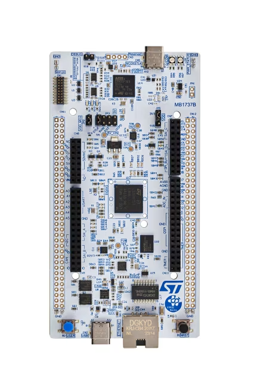
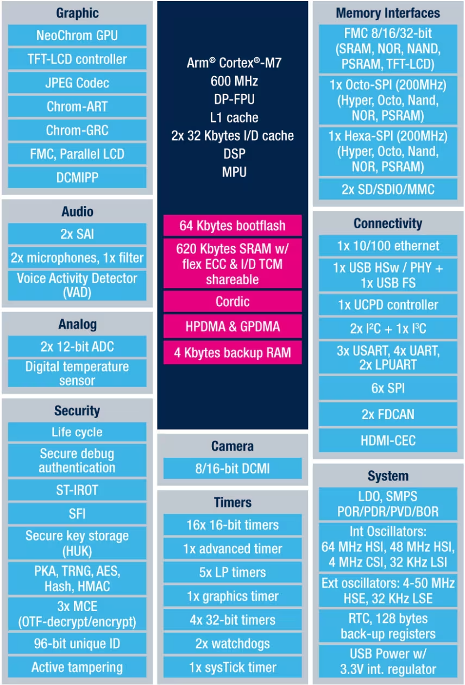

# NUCLEO-H7S3L8
Знакомство с STM32H7S3 на базе Development Board [NUCLEO-H7S3L8](https://www.st.com/en/evaluation-tools/nucleo-h7s3l8.html)

    

### [STM32H7S3L8](https://www.st.com/en/microcontrollers-microprocessors/stm32h7s3i8.html)

Устройства STM32H7Sxx8 основаны на высокопроизводительном 32-разрядном RISC-ядре Arm® Cortex®-M7, работающем на частоте до 600 МГц. Ядро Cortex -M7 оснащено модулем с плавающей запятой (FPU), который поддерживает команды и типы данных Arm двойной точности (совместимые с IEEE 754) и одинарной точности для обработки данных. Ядро Cortex -M7 содержит 32 Кбайт кэша команд и 32 Кбайт кэша данных. Устройства STM32H7Sxx8 поддерживают полный набор команд DSP и модуль защиты памяти (MPU) для повышения безопасности приложений.

Устройства STM32H7Sxx8 оснащены высокоскоростной встроенной памятью, 64 Кбайт пользовательской флэш-памяти и 128 Кбайт системной флэш-памяти, а также объемом до 620 Кбайт оперативной памяти (включая 128 Кбайт, которые могут совместно использоваться ITCM и AXI, включая 64 Кбайт исключительно ITCM, включая 128 Кбайт DTCM, включая 64 Кбайт исключительно DTCM, включая 32 Кбайт AHB и 4 Кбайт резервной оперативной памяти), а также широкий спектр усовершенствованных устройств ввода-вывода и периферии, подключенных к шинам APB, AHB-шинам, 2x32-разрядной матрице с несколькими AHB-шинами и многоуровневому соединению AXI, поддерживающему доступ к внутренней и внешней памяти. Для повышения надежности работы приложения во всех запоминающих устройствах предусмотрена функция коррекции кода ошибки (одно исправление ошибки, два обнаружения ошибки).

В устройства встроены периферийные устройства, позволяющие ускорять математические/арифметические функции (сопроцессор CORDIC для тригонометрических функций). Все устройства оснащены двумя АЦП, маломощным RTC, 4 универсальными 32-разрядными таймерами, 7 универсальными 16-разрядными таймерами, включая один ШИМ-таймер для управления двигателем, пятью маломощными таймерами и ячейкой криптографического ускорения (CRYP), ускорителем с открытым ключом (PKA), защищенный сопроцессор AES (SAES) и модуль шифрования памяти (MCE). Устройства поддерживают один цифровой фильтр для внешних сигма-дельта модуляторов или цифровой микрофон с функцией распознавания речевой активности. Они также оснащены стандартными и усовершенствованными коммуникационными интерфейсами.

 

    

